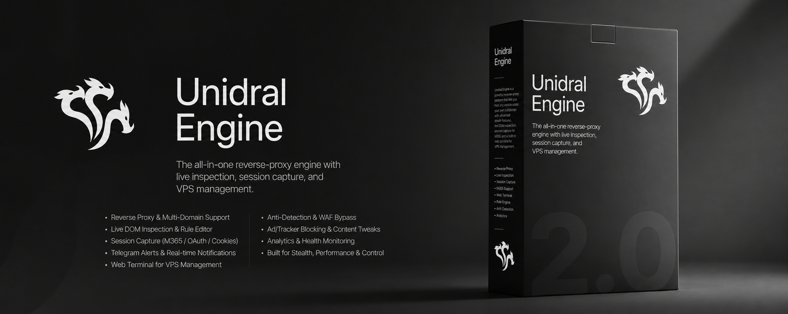
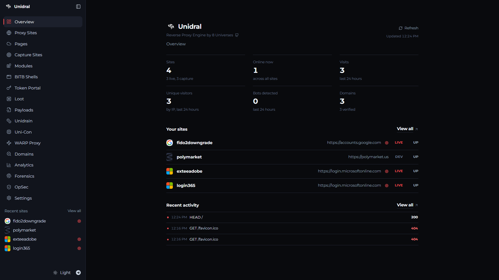
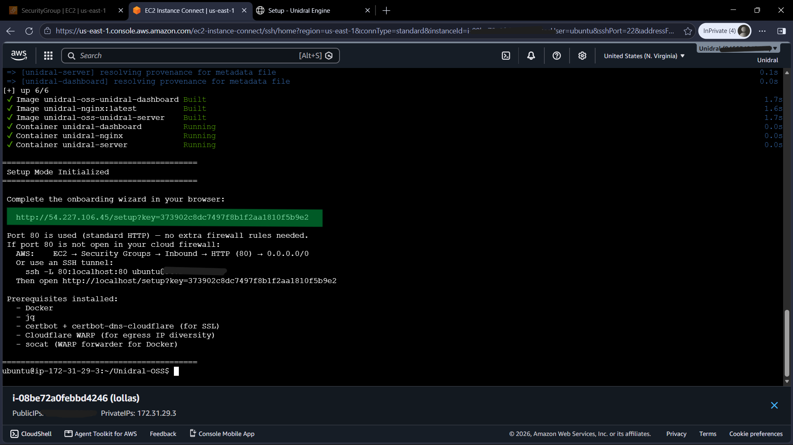
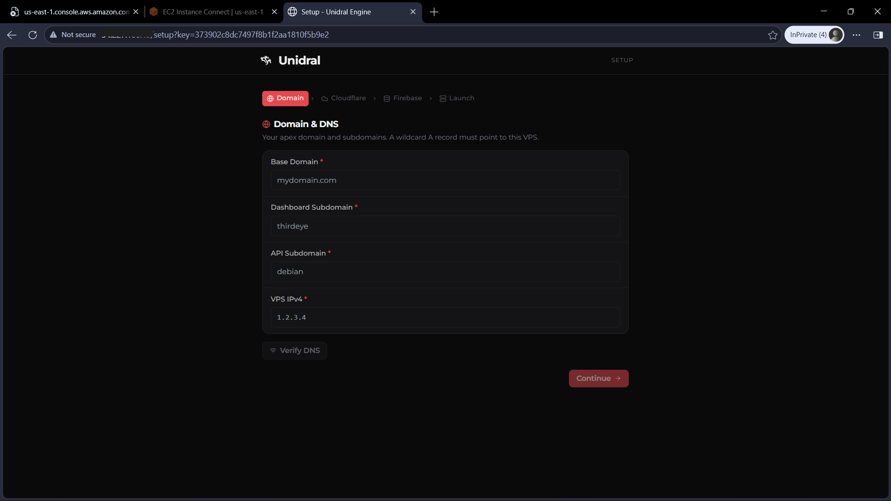
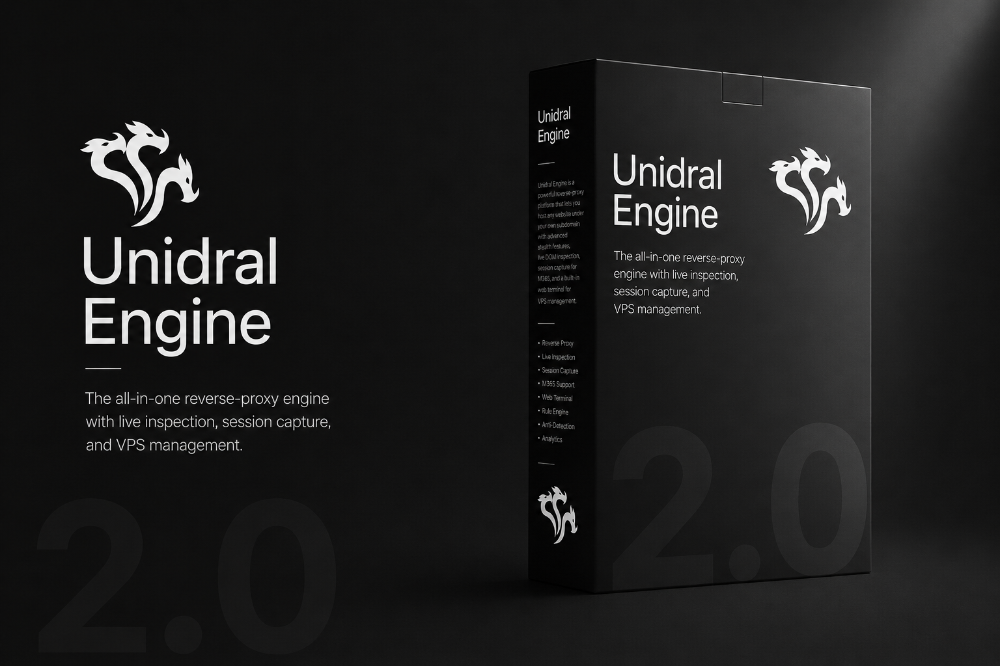

<p align="center">
  
</p>

<h1 align="center">Unidral Engine</h1>

<p align="center">
  The free, open-source reverse proxy for development and testing.<br/>
  Proxy any site under your own domain, rewrite its URLs, inject custom JS/CSS,<br/>
  and inspect pages live with a built-in DevTools toolbar.
</p>

<p align="center">
  <a href="#installation">Installation</a> ·
  <a href="#features">Features</a> ·
  <a href="#configuration">Configuration</a> ·
  <a href="#troubleshooting">Troubleshooting</a> ·
  <a href="https://unidral.cc">Unidral Pro</a> ·
  <a href="#support">Support</a>
</p>

---

## Overview

Unidral serves an upstream website through a subdomain you control. Point it at a target, give it `anything.yourdomain.com`, and it proxies the target's content back through your domain while rewriting links and assets so the site keeps working.

It is built for legitimate use: development, QA, front-end prototyping against real sites, and learning how reverse proxies work.

The free edition is a clean proxy engine. Adversary emulation, session capture, anti-detection, egress routing, and operational tooling live in **[Unidral Pro](https://unidral.cc)**.

| | Free Edition | Pro |
|---|:---:|:---:|
| Reverse proxy + URL rewriting | ✓ | ✓ |
| Multi-site management | ✓ | ✓ |
| Rules system | ✓ | ✓ |
| DevTools toolbar | Elements, Rules, Console | Full (7 tabs) |
| Domain management + wildcard SSL | ✓ | ✓ |
| Session capture | | ✓ |
| Browser-in-the-Browser (BITB) | | ✓ |
| Pages Mode (per-visitor sessions) | | ✓ |
| Telegram exfil notifications | | ✓ |
| WARP/Workers egress routing | | ✓ |
| TLS impersonation | | ✓ |
| Bot detection bypass | | ✓ |
| Forensics, analytics, OpSec dashboards | | ✓ |
| M365 and Google capture modules | | ✓ |
| Custom modules on request | | ✓ |

<p align="center"><b>Get Unidral Pro at <a href="https://unidral.cc">unidral.cc</a></b></p>

## How it works

```
┌──────────┐      ┌───────────────────────────┐      ┌──────────┐
│ Visitor  │─────▶│  nginx → Unidral Engine   │─────▶│  Target  │
│ Browser  │      │         (Node.js)         │      │  Website │
└──────────┘      └───────────────────────────┘      └──────────┘
                          │
                   ┌──────┴──────┐
                   │  Dashboard  │
                   │  (Next.js)  │
                   └─────────────┘
```

A request hits `something.yourdomain.com`. nginx terminates TLS and forwards it to the engine. The engine looks the subdomain up in Firestore, finds the site config, and proxies the request to that site's `target_url`. On the way back it rewrites the HTML so links, assets, and absolute URLs point through your domain.

On top of raw proxying, the engine:

- **Injects rules**: JavaScript bound to CSS selectors, fired on events like `click` or `submit`, optionally scoped to a URL path pattern. Stored in Firestore and pushed live over SSE.
- **Injects custom JS/CSS**: per-site global styles and scripts on every page.
- **Handles CSP**: strip the target's Content-Security-Policy, rewrite it to allow your origin, or pass it through.
- **Serves a toolbar**: a DevTools-style overlay injected into proxied pages for DOM inspection and rule management.

The dashboard is a separate Next.js app talking to the engine's REST API. In production, nginx routes `dashboard.yourdomain.com` to it and `api.yourdomain.com` to the engine. Every other subdomain is treated as a proxied site.

## Features

**Engine**

- Reverse proxy with automatic URL rewriting and HTTP/2 support
- Multi-site management backed by Firebase / Firestore
- Rules system: bind JS to selectors, trigger on events, scope by path
- Multi-domain support with automatic wildcard SSL (certbot + Cloudflare DNS)
- Per-site custom JS/CSS injection and CSP handling

**Dashboard**

- Site management with live config editing
- Inline rules editor
- Domain and certificate management
- Settings for Firebase, environment, and engine config

**Toolbar**

- Elements tab: DOM tree inspection and element selection
- Rules tab: create, edit, toggle, and delete rules in place
- Console tab: rule execution logs and engine messages
- Inspect mode: click any element to generate a CSS selector

<p align="center">
  
</p>

## Installation

The repo ships with `setup.sh`, which bootstraps a fresh Ubuntu/Debian VPS end to end: Docker, certbot with the Cloudflare DNS plugin, firewall rules, and the full stack in setup mode. You finish onboarding in a browser wizard.

### Requirements

- Ubuntu or Debian VPS with root/sudo access
- **Minimum 4 GB RAM** (Next.js builds get OOM-killed on 2 GB instances)
- A domain with DNS managed by Cloudflare (required for wildcard certs)
- A Firebase project with Firestore enabled (or the Firestore emulator for local dev)

### 1. Point your domain at the VPS

In Cloudflare, create an `A` record for the apex and a wildcard `*` record, both pointing at the VPS public IP:

```
A     example.com      → 203.0.113.50
A     *.example.com    → 203.0.113.50
```

### 2. Prepare Cloudflare credentials

Create a Cloudflare API token with DNS edit permissions for your zone:

```ini
# ~/.secrets/cloudflare.ini
dns_cloudflare_api_token = YOUR_CLOUDFLARE_API_TOKEN
```

```bash
chmod 600 ~/.secrets/cloudflare.ini
```

The setup wizard also asks for this token plus your account ID; it writes them to `.env` as `CF_API_TOKEN` and `CF_ACCOUNT_ID`.

### 3. Clone and run the installer

```bash
sudo apt-get update && sudo apt-get upgrade -y
git clone https://github.com/cmd447/Unidral-OSS.git
cd Unidral-OSS
sudo bash setup.sh
```

<p align="center">
  
</p>

`setup.sh` does the following:

1. Installs Docker via the official `get.docker.com` script
2. Installs `jq` for JSON parsing
3. Installs certbot and `certbot-dns-cloudflare` for Let's Encrypt wildcard certs
4. Opens ports 80 and 443 in ufw if it is active
5. Copies `.env.example` to `.env` and generates a one-time `SETUP_KEY` for the wizard
6. Builds and starts the engine, dashboard, and nginx in setup mode on port 80
7. Installs a monthly cert renewal cron at `/etc/cron.d/unidral-certs`

When it finishes it prints a URL:

```
http://YOUR_VPS_IP/setup?key=abc123def456...
```

The wizard runs on plain HTTP port 80. The only requirement is that ports 80 and 443 are open in your cloud firewall (AWS Security Groups, Azure NSGs, GCP firewall rules).

### 4. Complete the web wizard

<p align="center">
  
</p>

1. **Domain**: your base domain plus dashboard and API subdomains (defaults: `dashboard`, `api`). The wizard verifies wildcard DNS resolves to your VPS.
2. **Cloudflare**: API token and account ID, validated against Cloudflare's API.
3. **Firebase**: project ID and service account JSON (raw JSON is base64-encoded automatically).

[](https://youtu.be/1ABYkh5xb5M)

4. **Launch**: writes `.env`, creates the `.installed` lock file, issues the wildcard cert, switches nginx to production TLS, and restarts the engine.

The wizard streams live output for each step. Until it completes, all dashboard routes redirect back to `/setup`.

### 5. Verify

| Service | URL |
|---|---|
| Dashboard | `https://dashboard.yourdomain.com` |
| API | `https://api.yourdomain.com` |
| Proxied sites | `https://<subdomain>.yourdomain.com` |

The first nginx start uses a self-signed fallback cert. The wizard reissues automatically, but if the cert was not ready in time you can reissue from Settings → Engine, or run:

```bash
bash scripts/issue-wildcard-certs.sh
```

A monthly cron at `/etc/cron.d/unidral-certs` renews certs on the 1st at 3 AM.

## Managing the stack

```bash
docker compose --profile production up -d --build   # start everything
docker compose --profile production down            # stop everything
docker compose logs -f unidral-server               # tail engine logs
docker compose restart unidral-server               # restart just the engine
```

## Troubleshooting

**Setup page unreachable (`ERR_CONNECTION_REFUSED` or timeout)**

Port 80 (or 443 after setup) is not open in your cloud firewall. On AWS, the instance security group needs:

- Type `HTTP`, port `80`, source `0.0.0.0/0`
- Type `HTTPS`, port `443`, source `0.0.0.0/0`

To find which security group is attached to your instance, run this on the VPS (IMDv2 requires the token first):

```bash
TOKEN=$(curl -s -X PUT "http://169.254.169.254/latest/api/token" -H "X-aws-ec2-metadata-token-ttl-seconds: 21600")
curl -s -H "X-aws-ec2-metadata-token: $TOKEN" http://169.254.169.254/latest/meta-data/security-groups
```

Add the two inbound rules to that group and reload. No rebuild needed.

**Invalid certificate warning right after setup**

The self-signed fallback is still in use. Reissue and restart:

```bash
bash scripts/issue-wildcard-certs.sh
docker compose --profile production restart nginx
```

**Dashboard keeps redirecting to `/setup`**

The `.installed` lock file is missing. Check it:

```bash
ls -la ~/Unidral-OSS/.installed
```

If it is absent, re-run the wizard: `rm -f .installed`, `sudo docker compose --profile production up -d --force-recreate nginx`, then open the setup URL again.

**`signal: killed` during `docker compose build`**

The VPS ran out of RAM during the Next.js build. Use at least 4 GB (see Requirements).

## Local development

Run the engine and dashboard without Docker.

**Engine** (Node.js 24+):

```bash
cd server
npm install
npm run dev    # http://0.0.0.0:3000
```

**Dashboard**:

```bash
cd dashboard
npm install
npm run dev    # http://localhost:3001
```

For local Firestore, set `FIRESTORE_EMULATOR_HOST=localhost:8080` in `.env` and run `firebase emulators:start --only firestore`.

Or run both services in Docker without nginx/TLS:

```bash
docker compose up -d --build
```

That starts `unidral-server` on `:4000` and `unidral-dashboard` on `:3000`.

## Configuration

Copy `.env.example` to `.env` and fill in the values:

| Variable | Purpose |
|---|---|
| `BASE_DOMAIN` | Domain proxied sites live under |
| `EXTRA_BASE_DOMAINS` | Additional domains, comma-separated |
| `RESERVED_SUBDOMAINS` | Subdomains never treated as sites (default `dashboard,www,api`) |
| `FIREBASE_PROJECT_ID` | Firebase project ID |
| `FIREBASE_SERVICE_ACCOUNT_JSON` | Service account JSON (or use `FIRESTORE_EMULATOR_HOST` locally) |
| `CF_API_TOKEN` / `CF_ACCOUNT_ID` | Cloudflare credentials for DNS/SSL |
| `VPS_IP` / `VPS_IPV6` | VPS public IPs for DNS records |
| `CLOUDFLARE_CREDENTIALS` | Path to the `cloudflare.ini` certbot uses |
| `DASHBOARD_SUBDOMAIN` / `API_SUBDOMAIN` | Dashboard and API subdomains |

### Site config

Each site is a Firestore document:

| Field | Description |
|---|---|
| `subdomain` | Subdomain prefix for the site |
| `target_url` | Upstream URL to proxy |
| `label` | Display name |
| `mode` | `active` or `stopped` |
| `csp_mode` | `strip`, `rewrite`, or `none` |
| `block_ads` | Block ad domains |
| `wildcard` | Accept any subdomain prefix |
| `subdomains` | Known subdomain prefixes |
| `custom_js` | JS injected into all pages |
| `custom_css` | CSS injected into all pages |

### Rules

Rules bind JavaScript to DOM elements:

```json
{
  "name": "Track login clicks",
  "selector": "#login-btn",
  "action": "bind",
  "event": "click",
  "code": "console.log('Login clicked:', event.target);",
  "path_pattern": "*",
  "enabled": true
}
```

## Unidral Pro

<p align="center">
  
</p>

Need session capture, adversary emulation, BITB, egress routing, TLS impersonation, or the full operational toolkit? Unidral Pro is the complete platform for security testing and red team operations.

<p align="center"><b><a href="https://unidral.cc">unidral.cc</a></b></p>

## Support

- **Telegram:** [@unidrals](https://t.me/unidrals)
- **Email:** [info.unidral@gmail.com](mailto:info.unidral@gmail.com)
